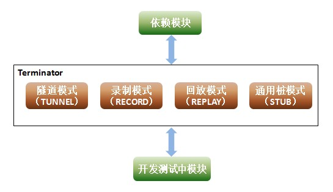
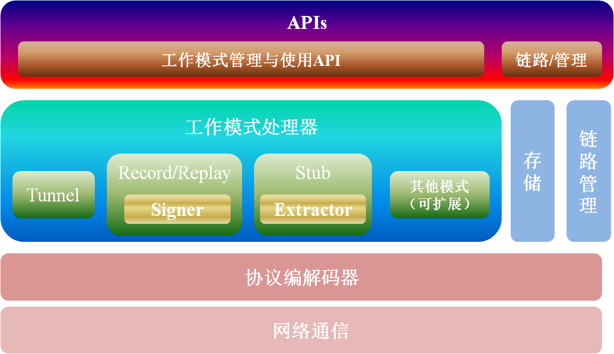

Terminator —— Service Virtualization
==========

问题
----------
在开发/测试一个复杂系统的时候我们经常遇到开发/测试中的模块依赖其它服务的情况。比如一个系统有两个模块A和B，A模块依赖于B模块提供的服务：

1. B部分功能还未完成开发导致A模块开发被阻塞；

2. B模块有些数据不好构造，开发时无法自测到所有情况；

3. 对A模块进行集成测试时，写了一些自动化用例。但由于B模块不可控，B模块的数据经常变动导致返回给A模块的数据也变化了，这时候依赖B模块返回数据的断言将失败；

4. B模块不是自己团队维护，经常出现不稳定，导致开发环境中整个系统不稳定。

解决方案
----------

		服务虚拟化指的就是虚拟出不稳定、不可用、未开发完全的服务。通常有两种方法：

1. 针对协议的通用桩，可以预先设置请求对应的返回值以及匹配条件，这样系统未开发完之前可以使用这个桩来代替真实的服务；

2. 录制回放方式，在第三方服务可用的时候将链路上的数据录制下来，当不稳定或者不可用时，回放当时录制的数据。

其中方案1主要针对问题一和二，方案2主要针对问题三和四。Terminator（寓意:明暗交界线）实现了以上两种方式。

		Terminator中每个链路可以看成是一个代理，运行在两个服务之间，现在支持四种工作模式：

TUNNEL：隧道模式，链路服务负责接收和转发链路上的数据，但不做任何存储，相当于通透状态;

RECORD：录制模式，链路服务将链路上的请求和响应存储下来，并记录请求响应的对应关系;

REPLAY：回放模式，链路服务不会连接后端的依赖服务，当请求过来时当符合某些条件时直接返回当时录制的响应;

STUB：通用桩模式，链路服务能够预设返回结果与匹配规则，当请求过来时符合匹配规则即返回预设结果。

整体架构
----------

1. 网络通信：主要在TCP层建立Socket收发链路上的通信数据，这里采用的是netty框架；

2. 协议编解码器：主要将二进制数据包解析为协议数据或者反过来将协议数据转化为二进制数据，netty本身提供了HTTP、SSL/TLS、WebSockets、Google Protocol Buffer的编解码器，如果需要扩展可以自己定义协议编解码器；

3. 工作模式处理器：本系统的核心，现在提供的录制回放、通用桩都是这里实现的。这里提供了较多的扩展接口，可以基于定制化需求实现新的模式，比如当后端服务down掉的情况下启动之前的录制数据。另外对于录制回放模式，签名类是一个核心组件，它的作用是如何标识一个请求，对于不同系统可能有不一样的实现；对于通用桩模式，抽取类是一个核心组件，他的作用是如何提取一个请求，涉及到如何设置匹配条件，对于不同系统（特别是协议）也可能有不一样的实现。所以这些都是系统提供的可扩展接口。

4. APIs:为了使用上的方便（比如持续集成），系统基本所有的功能都通过REST API提供。 

配置与部署
----------

将terminator.war解压为terminator；

将terminator/src/database/{version}/terminator.sql在MySQL数据库中执行，{version}为对应terminator.war的版本号；

修改terminator/src/conf/configuration.properties中数据库配置；

（可选操作）修改terminator/src/conf/configuration.properties中fileStorage.baseDir属性，这个是录制数据存放的位置，一般产生的数据较大，可以给定一个磁盘空间较大的位置。如果不填，默认情况window系统会存储在C:\temp，linux系统会存储在/tmp；
将terminator放入任何一个servlet容器后启动，比如tomcat的webapps下；

访问http://IP:Port/terminator。

使用手册和开发指南
----------
部署成功后，可以访问“用户手册”和“开发指南”
